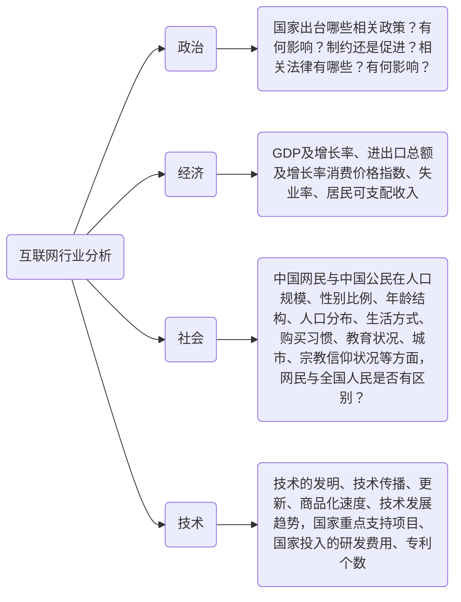
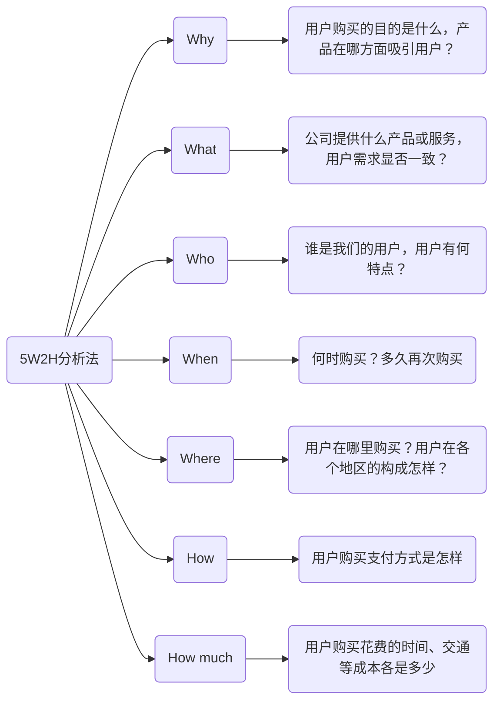
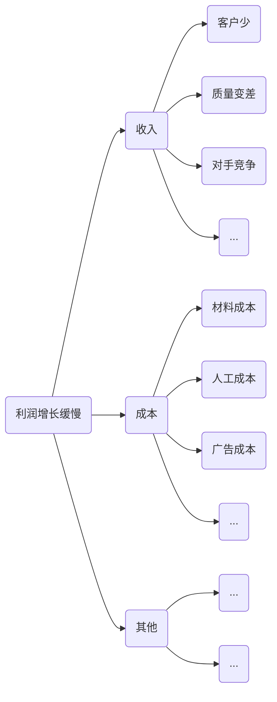

```mermaid
graph LR
A(互联网行业分析) --> B(政治) 
	B --> F("国家出台哪些相关政策？有何影响？制约还是促进？相关法律有哪些？有何影响？")
A --> C(经济)
    C --> G("GDP及增长率、进出口总额及增长率消费价格指数、失业率、居民可支配收入")
A --> D(社会)
	D --> H("中国网民与中国公民在人口规模、性别比例、年龄结构、人口分布、生活方式、购买习惯、教育状况、城市、宗教信仰状况等方面，网民与全国人民是否有区别？")
A --> E(技术)
	E --> I("技术的发明、技术传播、更新、商品化速度、技术发展趋势，国家重点支持项目、国家投入的研发费用、专利个数")
```

```mermaid
graph LR
A(5W2H分析法) --> B(Why)
	B --> I("用户购买的目的是什么，产品在哪方面吸引用户？")
A --> C(What)
	C --> J("公司提供什么产品或服务，用户需求显否一致？")	
A --> D(Who)
	D --> K("谁是我们的用户，用户有何特点？")	
A --> E(When)
	E --> L("何时购买？多久再次购买")
A --> F(Where)
	F --> M("用户在哪里购买？用户在各个地区的构成怎样？")
A --> G(How)
	G --> N("用户购买支付方式是怎样")
A --> H(How much)
	H --> O("用户购买花费的时间、交通等成本各是多少")
```

```mermaid
graph LR
A(利润增长缓慢) --> B(收入)
	B --> I("客户少")
	B --> L("质量变差")
	B --> M("对手竞争")
	B --> N("...")
A --> C(成本)
	C --> J("材料成本")	
	C --> P("人工成本")
	C --> O("广告成本")	
	C --> Q("...")
A --> D(其他)
	D --> K("...")	
	D --> R("...")	
```

